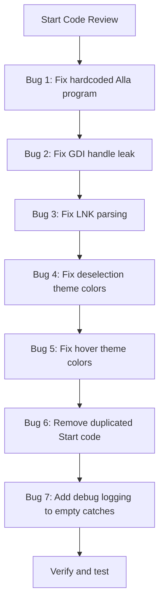

# Code Review: WindowsSmartTaskbar — Issues & Fix Plan

## Summary

After reviewing all source files (`MainForm.cs`, `ProgramItem.cs`, `Category.cs`, `Program.cs`, `WindowsSmartTaskbar.csproj`), I've identified **7 bugs** ranging from critical logic errors to resource leaks and theme inconsistencies.

---

## 🔴 Critical Bugs

### Bug 1: Hardcoded Swedish string `"Alla program"` instead of `DefaultCategory` constant

**Files:** [`MainForm.cs`](MainForm.cs:896), [`MainForm.cs`](MainForm.cs:1068), [`MainForm.cs`](MainForm.cs:1152)

The constant `DefaultCategory` is defined as `"All programs"` (English) on [line 26](MainForm.cs:26). However, three places hardcode the **Swedish** string `"Alla program"` for category filtering:

- **Line 896** — Double-click handler in `CreateProgramRow()`:
  ```csharp
  var filtered = currentCategory == "Alla program"  // ❌ WRONG
  ```
- **Line 1068** — `EditButton_Click()`:
  ```csharp
  var filtered = currentCategory == "Alla program"  // ❌ WRONG
  ```
- **Line 1152** — `RemoveButton_Click()`:
  ```csharp
  var filtered = currentCategory == "Alla program"  // ❌ WRONG
  ```

**Impact:** Since `currentCategory` is set to `DefaultCategory` which equals `"All programs"`, these comparisons **always fail**. This means:
- Double-clicking a program in "All programs" view will try to filter by category instead of showing all, possibly launching the wrong program or crashing.
- Editing/removing programs in "All programs" view uses the wrong filtered list.

**Fix:** Replace all three occurrences of `"Alla program"` with `DefaultCategory`.

---

### Bug 2: GDI Handle Leak in `GenerateAppIcon()`

**File:** [`MainForm.cs`](MainForm.cs:554)

```csharp
return Icon.FromHandle(bmp.GetHicon());  // Line 597
```

`GetHicon()` creates an **unmanaged GDI handle** (HICON). The `Bitmap` is correctly disposed via `using`, but the HICON is never freed with `DestroyIcon()`. This method is called **at least twice** (lines 256 and 422), leaking handles each time.

**Fix:** Add `[DllImport("user32.dll")] static extern bool DestroyIcon(IntPtr handle)` and properly manage the icon lifecycle:
```csharp
IntPtr hIcon = bmp.GetHicon();
Icon icon = Icon.FromHandle(hIcon);
Icon cloned = (Icon)icon.Clone();
DestroyIcon(hIcon);
return cloned;
```

---

### Bug 3: Incorrect LNK Shortcut Parsing

**File:** [`ProgramItem.cs`](ProgramItem.cs:66)

The `ReadShortcutTarget()` method has two parsing errors in the Windows `.lnk` binary format:

1. **Line 75:** reads the Link CLSID as `ReadUInt16()` (2 bytes), but the CLSID is a **GUID (16 bytes)**:
   ```csharp
   reader.ReadUInt16(); // ❌ Should skip 16 bytes for the GUID
   ```

2. **Line 96:** calculates `linkInfoStart` incorrectly:
   ```csharp
   var linkInfoStart = position + 4;  // ❌ Off by 4 bytes  
   ```
   The LinkInfo structure size field is part of the structure itself. The start should be `position`, not `position + 4`.

**Impact:** Extracting target paths from `.lnk` files will often fail or return garbage data, falling back to the unreliable text-parsing method.

**Fix:** Correct the CLSID skip to 16 bytes and fix the LinkInfo offset calculation.

---

## 🟡 Medium Bugs

### Bug 4: Deselection Uses Hardcoded Light-Theme Colors

**File:** [`MainForm.cs`](MainForm.cs:866)

In the Ctrl+Click toggle handler, when **deselecting** a row, the colors are hardcoded to the light theme:

```csharp
row.BackColor = Color.White;       // ❌ Should be theme-aware
nameLabel.BackColor = Color.White;  // ❌ Should be theme-aware
pathLabel.BackColor = Color.White;  // ❌ Should be theme-aware
```

**Impact:** In dark mode, deselecting an item turns it white — visually broken.

**Fix:** Use theme-aware colors:
```csharp
var bgColor = currentTheme == "dark" ? Color.FromArgb(45, 45, 45) : Color.White;
row.BackColor = bgColor;
nameLabel.BackColor = bgColor;
pathLabel.BackColor = bgColor;
// Also restore ForeColor to theme defaults
```

---

### Bug 5: Hover Effect Uses Hardcoded Light Color in Dark Mode

**File:** [`MainForm.cs`](MainForm.cs:921)

```csharp
row.BackColor = Color.FromArgb(235, 240, 255);  // Always light blue
```

**Impact:** In dark mode, hovering over a row flashes it to a light blue color — visually jarring.

**Fix:** Use a theme-aware hover color:
```csharp
row.BackColor = currentTheme == "dark" 
    ? Color.FromArgb(55, 55, 65) 
    : Color.FromArgb(235, 240, 255);
```

---

### Bug 6: Duplicated Identical Code in `Start()` Method

**File:** [`ProgramItem.cs`](ProgramItem.cs:165)

The `if/else` branches at lines 167-188 execute **identical code**:

```csharp
if (!File.Exists(targetPath))   // Branch A
{
    var startInfo = new ProcessStartInfo { ... UseShellExecute = true };
    Process.Start(startInfo);
}
else                             // Branch B - exact same code!
{
    var startInfo = new ProcessStartInfo { ... UseShellExecute = true };
    Process.Start(startInfo);
}
```

**Impact:** No functional bug, but dead code makes maintenance harder and is confusing. The `File.Exists` check is meaningless.

**Fix:** Remove the `if/else` and keep a single block.

---

## 🟢 Low Priority / Code Quality

### Bug 7: Empty Catch Blocks Throughout the Code

**Files:** Multiple locations in [`MainForm.cs`](MainForm.cs) and [`ProgramItem.cs`](ProgramItem.cs)

Locations:
- [`ProgramItem.cs:47`](ProgramItem.cs:47) — `LoadIcon()`
- [`ProgramItem.cs:61`](ProgramItem.cs:61) — `GetShortcutTarget()`
- [`ProgramItem.cs:112`](ProgramItem.cs:112) — `ReadShortcutTarget()`
- [`ProgramItem.cs:128`](ProgramItem.cs:128) — nested fallback
- [`MainForm.cs:271`](MainForm.cs:271) — `EnsureDataFolder()`
- [`MainForm.cs:692`](MainForm.cs:692) — `LoadSettings()`
- [`MainForm.cs:707`](MainForm.cs:707) — `SaveSettings()`
- [`MainForm.cs:825`](MainForm.cs:825) — icon bitmap conversion

**Impact:** Any exceptions are silently swallowed, making bugs extremely hard to diagnose. At minimum, these should log to `System.Diagnostics.Debug`.

**Fix:** Add `System.Diagnostics.Debug.WriteLine()` to all empty catch blocks.

---

## Execution Flow



---

## Files to Modify

| File | Changes |
|------|---------|
| [`MainForm.cs`](MainForm.cs) | Bugs 1, 2, 4, 5, 7 |
| [`ProgramItem.cs`](ProgramItem.cs) | Bugs 3, 6, 7 |
